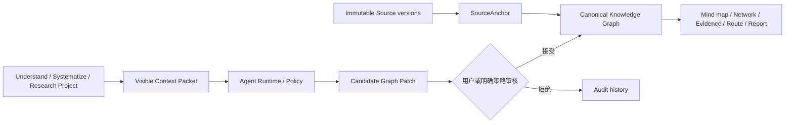

# AlphaAiGraph

AlphaAiGraph 是一个 AI 驱动的认知、知识体系构建与研究平台。它把复杂资料、已有经验和研究问题转化为可继续生长、可追溯、可审核的 Knowledge Graph（知识图谱），而不是把结果留在一次性聊天或孤立报告里。

## 三类 Project

| 模式 | 用户目标 | 主要产物 | 完成方式 |
| --- | --- | --- | --- |
| Understand | 搞清楚技术、论文、文档、代码库或复杂问题 | 第一层知识地图、渐进下钻、问答、阶段总结、知识缺口 | 用户确认已理解到所需深度 |
| Systematize | 梳理、验证、纠偏并完善已有知识 | Knowledge Inventory、结构化知识、适用上下文、诊断与影响审查 | 关键结构、缺口和冲突得到处理 |
| Research | 通过主动搜索、多轮分析和验证形成可信结论 | Brief、Plan、Task、Round、Verification、结论、情景化技术路线 | 结论可追溯，冲突与不确定性得到说明 |

`ProjectMode` 表达用户想完成什么；技术、文档、论文、代码库、行业、主题和问题只是 `SubjectKind`。三类 Project 共用同一个 Knowledge Space、Knowledge Graph、不可变 Source Store、Agent Runtime 和审计链。

## 核心架构



系统遵守以下不变量：

- `KnowledgeGraph` 是唯一知识主数据；视图、报告和技术路线不复制第二套知识。
- Project 保存目标、工作流、完成标准和图谱范围，不复制节点与关系。
- 原始来源按版本不可变；事实性 Claim 必须能定位到有效 `SourceAnchor`。
- Agent 的结构变更先进入 `CandidateGraphPatch`，接受后才写入正式图谱。
- 用户知识、结论和路线决策不会被静默覆盖；纠偏保留演化和影响审查历史。
- 第一张图只提供高层结构，深度由用户从任意节点逐步选择。

## 当前能力

- React 工作台中的三模式 Project 入口、图谱视图、节点下钻、提问、总结和显式完成/重开。
- Markdown、纯文本和 PDF 解析，不可变 source version、locator、quote 和 provenance（来源追踪）。
- 可见 Context Packet、provider-neutral Agent contract、超时/重试/usage/cost 审计，以及 DeepSeek/GLM 的 OpenAI-compatible adapter。
- Systematize 的知识清单、六维访谈、重复/冲突/缺口/过期/locator 诊断、Explorer 可信搜索/筛选/批量收录，以及纠偏影响审查。
- Research 的 Brief → Plan → Task → Round → Search → Verification → Conclusion → Route 全链路 contract 和治理。
- browser `localStorage` 的 schema v2 持久化、旧 schema 安全迁移和敏感字段拒绝。
- Markdown 单文件导出、Obsidian-compatible Wiki Vault ZIP 确定性 round-trip，以及受审核的导回差异。
- 局部邻居、最短路径、weak component、全文搜索、跨 Project 无复制复用和大图渐进投影。
- 受控 V1 Research JSON 导入：旧证据必须重新对账 immutable source hash，命令、脚本和原始输出不会写入 workspace。

默认工作台仍以本地确定性 policy 展示完整治理闭环。真实模型 adapter 已有运行时边界，但 API key 不应直接放入浏览器；应通过可信后端或桌面桥接注入。

Explorer 未配置搜索服务时使用浏览器 handoff 和手动原文收录。可信宿主可在应用启动前注入 `globalThis.__ALPHA_AI_GRAPH_EXPLORER__` 的 endpoint、Provider ID、隐私/费用说明和价格类型；前端 adapter 不接受 key，只向该 endpoint 发送查询或用户选择的 URL。完整 contract 见 [Explorer 搜索体验规格](docs/superpowers/specs/2026-07-16-alpha-ai-graph-explorer-search-experience.md)。

## 本地开发

需要 Node.js 当前 LTS、npm 和 Rust stable toolchain。

```powershell
npm install
npm run dev
```

也可以使用项目提供的 PowerShell 启动脚本：

```powershell
npm run start:web
```

生产构建与预览：

```powershell
npm run build
npm run preview
```

## 测试与质量门禁

完成实现前必须按顺序运行：

```powershell
npm test
npm run build
cargo test --workspace
```

聚焦测试示例：

```powershell
npm test -- src/App.test.tsx
npm test -- src/knowledge/knowledgeEngine.test.ts
```

可复现基准：

```powershell
npm run benchmark:graph
npm run benchmark:search
```

搜索 benchmark 的真实 embedding 评估可能下载公开模型到用户缓存；默认测试不会执行该慢速用例。当前离线评估支持把 lexical、BM25、embedding 与 RRF hybrid 放在同一套 Recall@10、MRR@10、nDCG@10 和 latency 指标下比较，但产品路径尚未预设引入向量数据库。

## 仓库结构

```text
src/types.ts                         TypeScript 权威 contract
src/components/KnowledgeWorkspaceShell.tsx
                                      当前唯一主工作台
src/state/useKnowledgeWorkspace.ts    当前主状态 hook
src/knowledge/                        图谱、来源、Agent、Research、持久化与测试
src/knowledge/providers/              provider adapters
crates/alpha_graph_core/              Rust 领域与 serde contract
crates/alpha_agent_harness/           provider-neutral Agent 边界
crates/alpha_exporters/               Markdown exporter
docs/DEVELOPMENT.md                    开发者导航
docs/superpowers/specs/                产品、contract、评估与迁移规格
Plan-v2.md                             当前实施计划
```

旧 Research Cockpit、`useResearchWorkspace` 和 `src/research/` 已在迁移完成并经用户确认后移除。V1 `ResearchWorkspaceSnapshot` TypeScript 类型、受控导入器和少量 Rust `ResearchNode` 公共 API 仍是兼容边界，不是第二套产品模型。

## 文档权威顺序

1. [产品理念](docs/superpowers/specs/2026-07-13-alpha-ai-graph-product-philosophy.md)
2. [Project 产品模型 contract](docs/superpowers/specs/2026-07-14-alpha-ai-graph-project-model-alignment.md)
3. [当前实施计划](Plan-v2.md)
4. [阶段 0 知识图谱架构基线](docs/superpowers/specs/2026-07-13-alpha-ai-graph-knowledge-route-system.md)
5. [开发者指南](docs/DEVELOPMENT.md)

2026 年 5 月的 Research Map、Research Cockpit 和 UI 规格，以及根目录 `Plan.md`，只作为 V1 历史和 benchmark 语料保留，不能覆盖当前产品方向。

## 安全与工作区约束

- 不要提交 `.env*`、token、API key、credential、私钥、本地数据库或其他私有配置。
- provider key 默认禁止在浏览器 runtime 中使用。
- 不要把 Agent 输出直接写入正式图谱；所有高影响变更必须经过 Patch 审核。
- 不要自动递归清理 `node_modules/`、`target/`、`dist/`、`.tmp/` 或 `.codegraph/`；详细规则见 [AGENTS.md](AGENTS.md)。
