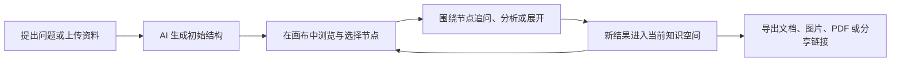
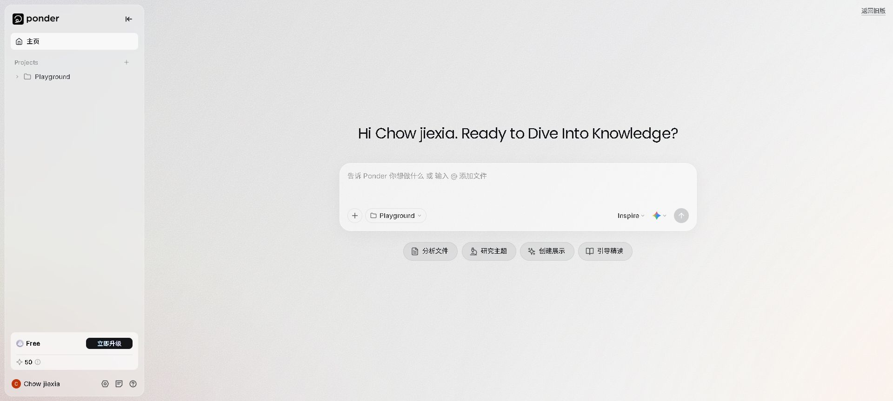
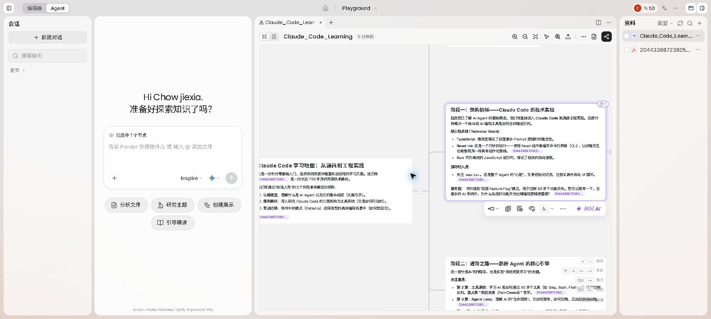
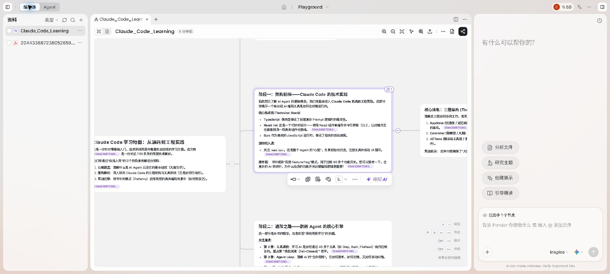
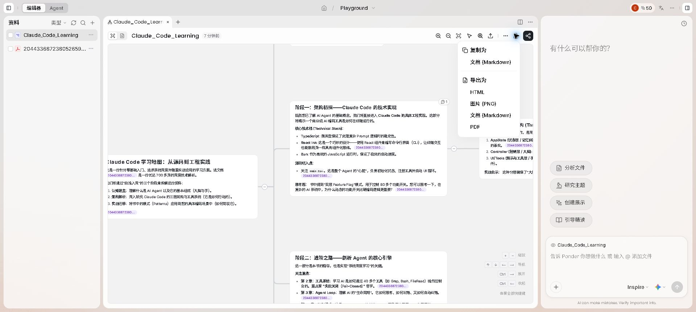
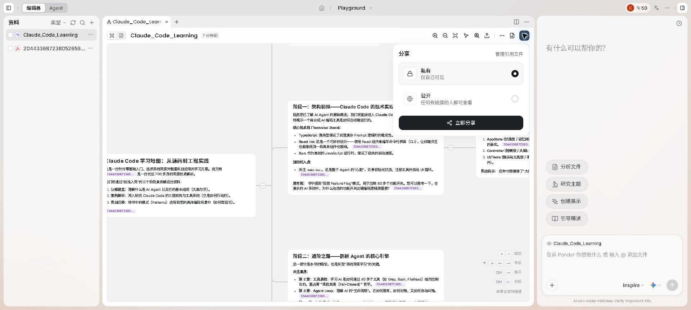
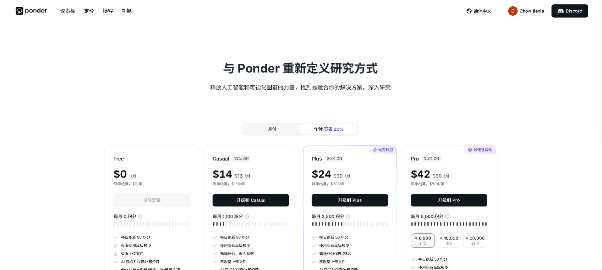

# ponder.ing 产品分析

> 分析日期：2026-07-13
> 产品地址：https://ponder.ing/
> 分析对象：Ponder Web 端中文界面、已登录项目工作台、公开定价页、服务条款与隐私政策
> 分析方法：公开资料研究 + 真实产品只读走查；未创建内容、未运行新的 AI 任务、未上传文件、未公开分享、未购买套餐

## 1. 执行摘要

Ponder 是一款 **AI 原生的空间化研究工作台（AI-native spatial research workspace）**。它将多格式来源、AI 分析、无限画布、节点级追问和成果导出放在同一个项目空间里，试图解决知识工作中最常见的断裂：资料存在文件或网页中，分析发生在聊天工具中，结构整理发生在脑图或白板中，最终交付又回到文档和演示工具中。

Ponder 的产品公式可以概括为：

```text
多格式来源 + AI 分析/RAG + 无限画布 + 节点级 Agent + 成果导出与分享
```

它不是单纯的“AI 脑图”，也不是给文件外挂一个聊天框。其真正核心是：**用户选择画布中的知识对象，Agent 围绕这个局部上下文继续研究，新的结果再回到同一空间中。**

Ponder 当前最有价值的产品创新包括：

1. 用“选择节点”明确 Agent 的上下文边界。
2. 将 Agent 模式与编辑器模式设计成同一知识对象的不同布局，而不是两套数据。
3. 让生成内容中的引用可以回到原始 PDF 的具体页码。
4. 从提问或上传开始，降低知识图谱类产品的首次使用门槛。
5. 支持 Markdown、HTML、PNG、PDF 和公开链接，形成从探索到交付的完整闭环。

其主要问题也很明确：

- 可见界面更接近“富文本卡片组成的分支脑图”，图关系的语义不够明确。
- AI 生成内容直接呈现在画布上，缺少明显的候选变更、置信度和人工确认机制。
- 多栏布局、低对比度文字和高密度卡片会造成较高认知负担。
- 分享权限较基础，公开材料尚不足以证明其企业级协作和合规成熟度。
- 公开可检索内容以官方营销页和博客为主，独立长期使用证据较少。

综合判断：Ponder 已经形成了有辨识度的交互形态，但它的竞争壁垒不在底层模型，而在能否让用户持续积累可复用、可追溯、可扩展的知识空间。

## 2. 产品定位

Ponder 在官网将自己定义为面向人类思维方式的知识工作空间，强调想法可以自由分支、关联和演化，不再受线性文档、聊天记录或传统笔记结构限制。

从真实产品来看，更准确的定位是：

> 面向研究者与知识工作者的 AI 辅助多源信息综合、空间化理解和成果生产平台。

它同时覆盖四个传统工具类别的部分能力：

| 工具类别 | Ponder 覆盖的能力 |
|---|---|
| 文献与来源管理 | 上传 PDF、网页、视频、文本等资料，在项目内统一调用 |
| AI 研究助手 | 文件分析、主题研究、追问、总结、跨资料综合 |
| 脑图与无限画布 | 以卡片、分支和连接呈现知识结构 |
| 内容生产工具 | 生成文档、演示结构，并导出 Markdown、PDF、HTML、PNG |

它并不试图在单一能力上取代专业工具，而是通过减少工具切换来创造价值。

## 3. 目标用户与核心任务

### 3.1 官方目标用户

Ponder 公开列出的用户包括：

- 研究者
- 分析师
- 学生
- 知识工作者
- 内容创作者

这些人群表面上差异很大，但共享同一个核心需求：从大量异构资料中建立结构化理解，并将理解转化为可复用成果。

### 3.2 Jobs to Be Done

Ponder 主要承接以下用户任务：

1. 当我面对大量资料时，帮我快速建立全局结构，而不是逐篇阅读后再手工整理。
2. 当我对某一局部产生疑问时，让我直接围绕当前节点继续追问，不必重新描述上下文。
3. 当多个来源出现相似、冲突或互补观点时，帮我发现它们之间的关系。
4. 当研究过程逐渐复杂时，帮我把来源、结论和思考路径保留在同一个空间中。
5. 当我需要交付时，把探索过程转换为文档、图片、PDF 或可分享页面。

### 3.3 最适合的使用场景

Ponder 更适合以下任务：

- 文献综述与课程精读
- 技术资料学习地图
- 多份报告的主题归纳和比较
- 竞争研究与行业分析
- 围绕一个主题持续扩展的个人研究项目
- 从研究材料生成报告或演示结构

它不一定适合高强度数据计算、严格系统综述、正式参考文献管理、复杂项目管理或需要强审批治理的企业知识流程。这些场景仍可能需要专门工具配合。

## 4. 核心产品循环



这一循环的关键不是“AI 能否生成脑图”，而是用户能否反复执行“选择—追问—沉淀”，且不丢失来源和空间上下文。

## 5. 信息架构与界面结构

### 5.1 起始页：任务优先，而不是对象优先



起始页提供四个直接任务入口：

- 分析文件
- 研究主题
- 创建展示
- 引导精读

用户也可以直接输入问题或通过 `@` 添加文件。这个设计绕开了“先建立项目结构、再创建节点、再配置图谱”的传统复杂流程。

优势：

- 新用户不必理解产品内部对象模型。
- 既支持问题驱动，也支持来源驱动。
- 快捷任务覆盖研究、学习和成果生产三个阶段。

风险：

- “Inspire”等模式或模型控制的语义不够直观。
- 项目、资料和一次研究任务之间的边界需要通过后续使用才能理解。

### 5.2 Agent 模式：将对话提升为主操作界面



Agent 模式同时呈现：

- 左侧会话列表
- Agent 输入区
- 中央视觉画布
- 右侧资料列表

其中最重要的交互是输入框上方的“已选中 1 个节点”。它让用户知道 AI 当前将围绕哪个对象工作，也使节点选择成为一种可见的上下文控制机制。

这比普通聊天工具依赖隐含上下文更可靠，因为用户可以通过选择对象主动缩小问题范围。

主要风险是四栏同时存在时注意力较分散。对于已经很大的画布，用户需要同时判断会话、选择状态、图结构和来源，容易产生视觉与认知负担。

### 5.3 编辑器模式：将画布提升为主操作界面



编辑器模式重新安排同一批对象：

- 左侧为资料
- 中间为画布
- 右侧为 Agent

这说明“Agent / 编辑器”不是两套产品，而是同一项目状态的两种注意力布局：

- Agent 模式适合提出问题和启动任务。
- 编辑器模式适合浏览、选择、组织和修改知识结构。

这种设计避免了在聊天、脑图和资料阅读器之间反复跳转，是 Ponder 体验连续性的核心。

## 6. 可观察的知识对象模型

从界面和可访问结构中，可以观察到以下对象：

| 对象 | 可见表现 | 作用 |
|---|---|---|
| 项目 | 例如 Playground | 容纳资料、会话与产出 |
| 资料 | PDF、生成文档等 | AI 分析与引用来源 |
| 会话 | 左侧聊天列表 | 保存 Agent 交互历史 |
| 画布文档 | 例如 Claude_Code_Learning | 承载当前可视化成果 |
| 节点/卡片 | 包含标题、段落、列表和引用 | 表达局部知识内容 |
| 边 | 卡片之间的连接线 | 表达层级或关联 |
| 选择集 | “已选中 1 个节点” | 控制 Agent 上下文 |
| 引用 | 文本中的来源编号和 PDF 页码链接 | 支持事实核验 |

### 6.1 它是否是真正的知识图谱

Ponder 的营销材料使用 knowledge graph、knowledge map 等术语，但从当前可见界面无法确认其底层是否保存了严格的类型化图谱。

界面证据更接近：

- 节点是包含较长文本的文档卡片。
- 边主要表达分支或层级，未显示明确的关系类型。
- 事实、总结、推断、问题和建议可能混合在同一个卡片正文中。
- 引用能够回到来源页码，但 claim 与 evidence 是否为独立对象不可见。

因此，将其描述为“AI 生成并持续扩展的视觉知识地图”更稳妥。是否具有实体消歧、类型化关系、全局节点复用、图查询等能力，需要产品内部数据模型或 API 才能确认。

## 7. Agent 交互设计

### 7.1 节点选择即上下文

Ponder 最有价值的 Agent 设计是把画布选择状态带入输入框。它解决了三个问题：

1. 用户知道 Agent 当前在分析什么。
2. 用户不需要在每次追问中重复描述上下文。
3. Agent 输出能够自然归属到某个局部结构。

### 7.2 快捷任务降低提示词门槛

“分析文件、研究主题、创建展示、引导精读”等操作把提示词封装成产品动作，使非专业用户不必自己设计复杂 Prompt。

### 7.3 Agent 输出的治理不足

当前可见界面中，AI 生成内容与用户确认内容在视觉上没有明显区分，也未看到：

- 候选变更预览
- 逐项接受或拒绝
- 置信度
- 待验证状态
- 结论冲突提示
- AI 修改前后的差异比较

对于学习和探索，这种直接写入体验较流畅；对于研究、技术决策或企业知识，这会增加错误内容被当作正式结论保留的风险。

## 8. 来源与可追溯性

真实项目中的生成卡片包含来源编号，并能指向 PDF 的具体页码，例如第 41、42、52 页。这种页级引用比单纯列出文件名更有价值。

优势：

- 用户能够快速核验 AI 总结。
- 来源与结论位于同一工作空间。
- 后续分享时可以管理引用文件是否随成果公开。

尚不明确的部分：

- 原始来源是否不可变。
- 引用是否绑定到稳定的文本片段，而不仅是页码。
- 来源更新后引用如何处理。
- AI 推断和来源事实是否被明确区分。
- 多个来源支持或反驳同一 claim 时如何表达。

## 9. 成果导出与分享

### 9.1 导出



当前产品支持：

- 复制为 Markdown
- 导出 HTML
- 导出 PNG
- 导出 Markdown
- 导出 PDF

这使 Ponder 不只是探索环境，也能作为交付物生成器。用户可以把画布转化为文章草稿、研究报告、静态图片或可归档文档。

### 9.2 分享



当前可见分享权限包括：

- 私有：仅自己可见
- 公开：任何拥有链接的人都可以查看
- 管理引用文件

“管理引用文件”是一个重要的隐私与版权控制点。但当前可见权限仍较基础，尚未看到编辑、评论、团队角色、组织空间或细粒度来源权限。

## 10. 功能版图

| 能力层 | 已观察到或官方公开的能力 | 成熟度判断 |
|---|---|---|
| 来源输入 | PDF、文本、网页、视频等多格式输入 | 核心能力 |
| AI 分析 | 文件分析、主题研究、总结、追问 | 核心能力 |
| 空间组织 | 无限画布、卡片、分支、选择节点 | 核心差异化 |
| 来源引用 | 生成内容关联原始文件及具体页码 | 重要优势 |
| Agent | 节点上下文、对话、快捷任务 | 核心差异化 |
| 内容编辑 | 卡片内容浏览、节点操作、画布工具 | 已具备基础能力 |
| 输出 | Markdown、HTML、PNG、PDF、展示内容 | 较完整 |
| 分享 | 私有或公开链接、管理引用文件 | 基础能力 |
| 协作 | 官方材料提及团队协作，但本次未验证实时协作 | 尚待验证 |
| 知识治理 | 版本入口可见，但候选变更、冲突和审批治理不明显 | 偏弱或不可见 |

## 11. 商业模式与定价

截至 2026-07-13，年付模式下的公开套餐为：



| 套餐 | 年付折算价格 | 月度积分 | 主要差异 |
|---|---:|---:|---|
| Free | $0/月 | 0 | 每日刷新 50 积分；高级模型和文件上传受限 |
| Casual | $14/月 | 1,100 | 使用全部高级模型、不限量上传、充值积分永久有效 |
| Plus | $24/月 | 2,500 | 充值优惠、高峰时段优先运行 |
| Pro | $42/月 | 6,000 | 更高充值优惠、最高运行优先级、抢先体验进阶功能 |

所有套餐页面均显示每日刷新 50 积分。Pro 还提供额外积分充值选项。

### 11.1 定价逻辑

Ponder 采用：

```text
订阅费 + 月度积分 + 每日免费积分 + 额外积分充值
```

这与产品的成本结构匹配，因为多文件分析、长文档处理和高级模型调用会产生不同推理成本。

### 11.2 商业优势

- 免费用户可以持续体验核心循环，而不只是一次性试用。
- 付费档位主要按使用量和运行优先级区分，理解成本相对较低。
- 充值机制可以覆盖重度用户的峰值需求。
- 所有套餐保留相似的产品形态，不会因功能阉割破坏核心体验。

### 11.3 商业风险

- 用户难以预测一次复杂研究会消耗多少积分。
- 服务条款明确说明积分消耗会随复杂度、数据量、持续时间和模型等级变化，固定积分不能保证固定数量或质量的产出。
- 当研究任务失败或 AI 输出质量不佳时，已消耗积分通常不可退款，容易产生价值感争议。
- 如果用户主要把它当作偶尔使用的脑图生成器，订阅留存可能不足。

## 12. 技术与模型策略

根据 Ponder 服务条款，其 AI 功能会使用 Google Gemini、OpenAI、Anthropic Claude 及其他经过筛选的企业级大模型。

因此，Ponder 的潜在护城河不在基础模型，而在以下四个方面：

1. 节点选择驱动的 Agent 交互习惯。
2. 用户长期积累的资料、地图、会话和知识结构。
3. 跨资料分析、空间组织和成果导出的一体化工作流。
4. 来源与知识产出之间的持续关联。

如果用户只把 Ponder 当作一次性脑图生成器，切换成本很低；如果用户把长期研究项目和知识资产持续沉淀在其中，切换成本才会逐步形成。

## 13. 隐私、信任与企业成熟度

### 13.1 官方公开承诺

Ponder 的隐私政策与服务条款声明：

- 上传内容可能发送给第三方企业级 LLM API 处理。
- 官方声称这些企业级 API 不会使用用户内容训练模型。
- Ponder 自身不使用用户数据进行模型训练。
- 官方声称员工不会直接访问用户文件内容。
- 用户保留上传内容的权利。
- 用户可以删除上传内容，并可通过邮件请求删除账号和关联数据。

### 13.2 尚未从公开材料确认的能力

本次未在公开政策和产品界面中确认：

- SOC 2 或 ISO 27001 等认证
- 数据驻留地区选择
- 企业 DPA
- SSO/SAML
- 组织级审计日志
- 数据保留周期的精确定义
- 企业管理员和细粒度角色权限
- 法务保留、电子发现或自带密钥能力

这里的结论是“公开材料中未确认”，不代表产品一定没有这些能力。

## 14. UX 与视觉设计评估

### 14.1 做得好的部分

- 起点清晰：提问、上传或选择快捷任务即可开始。
- 当前上下文明确：“已选中 1 个节点”能降低误操作和重复说明。
- 模式切换保持对象连续：Agent 和编辑器只是布局变化。
- 来源始终靠近工作区：减少在文件阅读器与 AI 工具间切换。
- 视觉语言统一：低饱和度、轻边框和紫色高亮形成较强辨识度。
- 输出入口集中：复制、导出和分享位于同一工具栏。

### 14.2 主要 UX 风险

#### 信息密度过高

Agent 模式同时展示会话、输入区、画布和资料。对于大型研究项目，用户容易不知道下一步应该看哪里。

#### 卡片缺少渐进式披露

画布卡片包含较长正文。在全局视图中，文本会缩小到无法阅读；放大阅读时，又难以保留整体结构。产品需要更强的摘要层、折叠、过滤和焦点视图。

#### 关系表达不够明确

连接线缺少可见的关系标签。用户难以区分层级、因果、支持、反驳、相似和依赖等不同含义。

#### 图标操作依赖学习

节点工具栏和顶部工具栏包含较多图标，部分操作只有悬停或实际尝试后才能理解。

#### AI 与用户结论边界不清

AI 生成卡片看起来与正式知识内容一致，用户可能忘记哪些内容尚未验证。

## 15. 可访问性风险

本次通过页面截图与可访问结构观察到以下风险：

- 多个图标按钮没有可识别的无障碍名称。
- 占位文字、状态文字和次级信息对比度偏低。
- 部分文字尺寸较小，尤其是画布缩放后。
- 空间画布的阅读顺序与边关系难以通过线性屏幕阅读器表达。
- 多栏布局在浏览器缩放、窄屏和系统字体放大下可能出现重排问题。
- 快捷键提示可见，但未完整验证仅键盘操作是否覆盖节点选择、移动、展开和 Agent 提问。

这些是风险判断，不代表已经完成 WCAG 合规测试。仍需键盘、屏幕阅读器、对比度和响应式专项验证。

## 16. 增长与市场信号

Ponder 的公开获客路径主要包括：

- 大量围绕 AI research、knowledge workspace、mind map、literature review 等关键词的内容页面和博客。
- 免费套餐与每日积分形成产品驱动增长入口。
- Discord 社区入口。
- 多语言官网和产品界面。
- 面向研究者、学生、分析师和创作者的多场景营销。

公开检索结果目前高度集中在 Ponder 自身的功能页、博客和宣传内容。独立用户评测、公开案例、团队部署经验和长期准确性评估仍然有限。因此，官网评价只能视为营销材料，不能用于判断真实留存和产品成熟度。

## 17. 竞争壁垒判断

### 17.1 可能形成壁垒的部分

- 长期积累的用户知识空间和来源关系。
- 节点选择驱动的 Agent 上下文机制。
- 从来源到地图再到交付物的一体化体验。
- 大型画布的组织、搜索、聚焦和增量维护能力。
- 来源页级引用和分享时的引用文件管理。

### 17.2 较容易被复制的部分

- AI 生成脑图。
- PDF 总结与问答。
- 无限画布和基础节点交互。
- 快捷 Prompt 模板。
- Markdown、PDF、PNG 导出。
- 多模型接入。

Ponder 能否形成长期壁垒，取决于它是否从“生成一次漂亮地图”进化为“维护长期可信知识资产”。

## 18. 对 AlphaAiGraph 的启示

Ponder 已经证明了“空间化 AI 研究工作台”是一种可理解、可使用的产品形态。AlphaAiGraph 不宜简单复制其画布，而应在图谱语义、证据治理和路线决策上建立差异。

| 维度 | Ponder 的可见实现 | AlphaAiGraph 的差异化机会 |
|---|---|---|
| 主数据 | 画布中的富文本卡片和视觉连接 | 单一、类型化 KnowledgeGraph |
| Agent 上下文 | 选择节点后提问 | 任意节点下钻、提问、总结、补证据和执行图操作 |
| 证据 | 卡片正文内的文件与页码引用 | claim、evidence、source 独立建模并可追溯 |
| AI 变更 | 生成内容直接进入画布 | candidate graph patch，用户确认后合入 |
| 关系 | 可视连接线，关系语义不明显 | 支持、反驳、因果、约束、决策等 typed edges |
| 多视图 | Agent/编辑器布局切换 | 脑图、全局网络、技术路线均为同一图谱投影 |
| 最终价值 | 研究整理和内容生产 | 可审计的技术路线推演和决策积累 |

值得直接借鉴：

1. 首次体验只要求输入主题或上传来源。
2. 在输入区明确展示当前选中节点和来源范围。
3. 让节点上的下钻、提问、总结成为直接操作。
4. 保持来源面板、画布和 Agent 的空间邻近。
5. 让视图切换只改变呈现方式，不复制主数据。
6. 提供从知识空间到 Markdown、图片和分享页面的清晰出口。

不应照搬：

1. 不要把整段 AI 回答作为无法计算的单一节点正文。
2. 不要只依赖无类型连接线表达知识关系。
3. 不要让 AI 生成结果静默成为正式图谱结论。
4. 不要在首屏同时放入过多面板和低优先级工具。
5. 不要用“知识图谱”名称替代真正的图数据模型和证据治理。

## 19. 最终结论

Ponder 当前是一款方向清晰、交互有辨识度的 AI 研究产品。它最成功的地方不是脑图生成质量，而是把来源、画布、节点选择和 Agent 对话组合成了连续工作流。

其下一阶段的关键挑战包括：

- 从视觉脑图走向语义更清晰的知识结构。
- 控制大规模画布的复杂度。
- 建立 AI 内容的验证与变更治理。
- 从链接分享走向真正团队协作。
- 用独立案例证明研究准确性、长期留存和企业可信度。

对 AlphaAiGraph 而言，Ponder 是一个重要的形态验证者，但不是最终产品目标。更合理的竞争策略是：

> 学习 Ponder 的低门槛输入、节点上下文和连续工作台体验，同时在类型化知识图谱、证据可追溯、候选变更审批和技术路线决策上形成更深的产品壁垒。

## 20. 证据限制

- 本次只读走查了一个已存在的学习地图项目，没有运行新的 AI 任务，因此未评价生成速度、积分消耗和输出稳定性。
- 未上传新的多格式文件，未验证音频、视频、网页抓取和扫描 PDF 质量。
- 未进行多人实时协作测试。
- 未进行移动端和窄屏测试。
- 未进行完整键盘、屏幕阅读器和 WCAG 合规测试。
- 未获得 Ponder 内部数据模型、系统架构、准确率评估或商业经营数据。
- 公开评价以官方材料为主，缺少足够的独立长期使用证据。

## 21. 主要资料来源

1. [Ponder 官方网站](https://ponder.ing/)
2. [Ponder 中文定价页](https://ponder.ing/zh/pricing)
3. [Ponder AI Research Agent 功能页](https://ponder.ing/features/ai-research-agent)
4. [Ponder AI Canvas 功能页](https://ponder.ing/features/ai-canvas)
5. [Ponder Knowledge Workspace 介绍](https://ponder.ing/blog/knowledge-workspace)
6. [Ponder 服务条款](https://ponder.ing/agreements/service.html)
7. [Ponder 隐私政策](https://ponder.ing/agreements/privacy.html)
