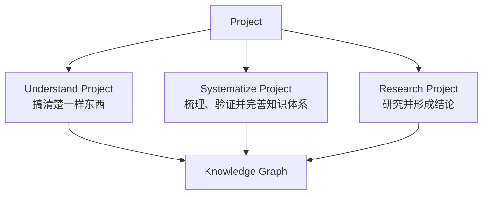
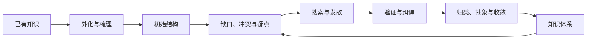
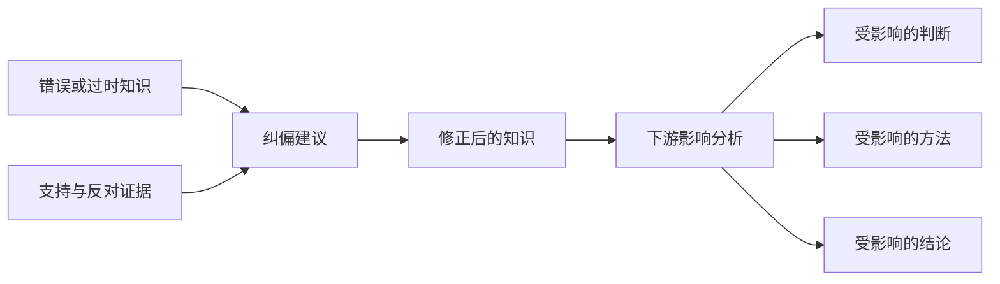

# AlphaAiGraph 产品理念：认知、知识体系构建与研究平台

> 状态：产品方向基线
> 日期：2026-07-13
> 作用：定义 AlphaAiGraph 的产品目标、Project 类型、共同底座和核心不变量。具体功能规格与实施计划必须与本文保持一致。

## 1. 产品定义

AlphaAiGraph 是一个 AI 驱动的认知、知识体系构建与研究平台。

它帮助用户完成三类核心任务：

1. 搞清楚一个复杂对象。
2. 梳理、验证并完善已有知识体系。
3. 基于资料开展研究，通过搜索、多轮分析和验证形成可信结论。

AI Agent、Knowledge Graph、脑图、RAG、搜索和推理模型都是实现手段，而不是产品本身。

> 产品的核心价值，是把零散资料、已有认知和复杂问题转化为结构化理解、持续演化的知识体系，以及可追溯的研究结论。

## 2. 产品原则

### 2.1 以用户目标定义产品，而不是以资料类型定义产品

技术、论文、行业、文档和代码库只是用户处理的对象类型。真正决定产品工作流的是用户想完成什么：理解、体系构建，还是研究结论。

### 2.2 Knowledge Graph 从第一步就是主数据

脑图、知识网络、研究进度、证据视图、结论报告和技术路线，都是同一 Knowledge Graph 的不同视图或子图。分析过程不能只停留在临时聊天记录中。

### 2.3 用户提供的资料只是起点，不一定是边界

当任务需要补充知识或形成结论时，Agent 应主动搜索相关资料、寻找原始来源、补充缺口、检查更新并寻找反例。

### 2.4 渐进展开，不一次性生成一切

第一张图只提供高层结构。用户从任意知识节点继续下钻、提问、补充资料、验证和总结，知识网络随有效工作逐步生长。

### 2.5 不静默改变用户知识和结论

Agent 生成的知识、纠偏、关系和结论先形成 Candidate Graph Patch。用户接受后才进入正式图谱。旧知识保留演化历史，不被无痕覆盖。

### 2.6 明确区分事实、经验、观点、推断和结论

每项知识都需要记录来源、创建者、认知状态和适用范围。用户经验不能被伪装成普遍事实，Agent 推断也不能被伪装成已有证据支持的结论。

## 3. 核心对象：Project

每一次认知、体系构建或研究活动都是一个 `Project`。



建议的顶层模式：

```ts
type ProjectMode =
  | "understand"
  | "systematize"
  | "research";
```

三类 Project 共享资料、Knowledge Graph、Agent Runtime、Context Packet、Candidate Graph Patch、版本和历史，但采用不同的工作流与完成标准。

| Project | 用户起点 | 主要目标 | 完成标准 |
| --- | --- | --- | --- |
| Understand | 对对象不熟悉或理解不完整 | 搞清楚一样东西 | 用户确认已经理解到所需深度 |
| Systematize | 已有零散知识、技能、经验或认知 | 梳理、扩展、验证、纠偏并形成体系 | 知识体系结构清晰，关键缺口和错误得到处理 |
| Research | 有研究问题、分析目标或判断需求 | 通过搜索、分析和验证形成结论 | 结论可追溯，重要冲突和不确定性得到说明 |

## 4. Understand Project：搞清楚一样东西

### 4.1 目标

帮助用户系统理解一个对象，例如：

- 一篇论文；
- 一个行业；
- 一项技术；
- 一门学科；
- 一本书；
- 一个代码库；
- 一个复杂系统。

### 4.2 工作流

```text
确定对象与范围
→ 导入或搜索资料
→ 生成第一层知识地图
→ 选择节点下钻
→ 提问、解释和补充资料
→ 建立概念与关系
→ 形成阶段总结
→ 识别知识缺口
→ 用户确认已经掌握
```

### 4.3 主要产物

- 可继续下钻的知识地图；
- 概念与关系网络；
- 来源和资料索引；
- 阶段总结；
- 知识缺口；
- 未解决问题。

### 4.4 完成标准

系统可以提示知识覆盖情况、核心概念、关键关系、争议和缺口，但不能擅自宣布用户已经理解。

最终由用户决定：

> 我已经搞清楚了，这个 Project 可以结束。

完成后的 Project 仍可在新资料或新问题出现时重新打开并继续迭代。

## 5. Systematize Project：梳理、验证并完善知识体系

### 5.1 目标

用户已经掌握一部分知识、技能或认知，但它们可能：

- 分散在笔记、文档、收藏和经验中；
- 缺少清晰结构；
- 存在重复、冲突或断层；
- 包含错误、过时或适用范围不清的内容；
- 尚未形成可使用、可维护的完整体系。

Systematize Project 帮助用户把已有知识外化、梳理、扩展、验证和纠偏，最终形成一套可持续演化的知识体系。

### 5.2 工作流

```text
导入已有资料
→ AI 访谈并外化隐性知识
→ 建立 Knowledge Inventory
→ 生成初始知识结构
→ 发现重复、缺口、冲突和疑点
→ 搜索新资料
→ 探究与发散
→ 验证已有知识
→ 提出纠偏建议
→ 用户审查
→ 收敛并重组体系
→ 检查纠偏影响
→ 形成完整知识系统
```

### 5.3 发散与收敛



发散阶段负责：

- 探索相邻领域；
- 搜索新资料；
- 提出新问题；
- 寻找不同观点和反例；
- 建立新的知识关联。

收敛阶段负责：

- 合并重复概念；
- 统一术语；
- 建立层次与依赖；
- 区分事实、观点、经验和方法；
- 抽象共同规律；
- 形成知识模块、技能树和学习路径。

### 5.4 纠偏是核心能力

系统需要识别：

- 事实错误；
- 概念偏差；
- 因果关系错误；
- 过度概括；
- 已经过时的知识；
- 只在特定场景成立的经验；
- 彼此矛盾的知识；
- 不正确的技能方法或实践习惯。

纠偏流程：

```text
原有认知
→ 标记疑点
→ 搜索支持与反对证据
→ 判断错误类型
→ 生成修正建议
→ 说明适用范围
→ 评估下游影响
→ 用户接受或拒绝
```

系统不能静默覆盖用户知识，也不能只凭一篇网页宣布用户错误。纠偏应优先使用原始或权威来源，检查时间、上下文和统计口径，并寻找独立来源、反对证据和其他合理解释。

建议的认知状态：

```ts
type EpistemicStatus =
  | "user_asserted"
  | "unverified"
  | "supported"
  | "contested"
  | "contradicted"
  | "outdated"
  | "context_dependent"
  | "superseded";
```

旧知识不直接删除，而是通过 `refines`、`corrects` 和 `supersedes` 等关系表达认知演化。

### 5.5 纠偏影响分析

一个错误前提可能已经被用于其他知识、方法、总结或结论。接受纠偏前，系统应生成 Impact Assessment，显示可能受影响的下游节点，并为这些节点创建待复核任务。



### 5.6 主要产物

- 主题知识图谱；
- 技能树和学习依赖；
- 学习路径；
- 方法论和实践手册；
- 课程或章节体系；
- 纠偏记录；
- 知识缺口；
- 待探索方向。

### 5.7 完成标准

> 已有知识得到结构化，关键缺口得到补充，高影响知识经过验证，明显错误和过时内容得到纠偏，剩余争议与不确定性被明确记录，并形成可持续迭代的知识体系。

## 6. Research Project：研究并形成结论

### 6.1 目标

围绕一个问题、分析目标或判断需求进行研究，例如：

- 一个行业未来的发展趋势是什么；
- 某项技术是否值得采用；
- 某个市场是否值得进入；
- 某篇论文的结论是否可靠；
- 多份资料中的观点为什么冲突。

### 6.2 初始资料不是研究边界

用户提供的资料只是初始资料集。系统还需要主动搜索相关材料、查找原始来源、补充缺失信息、搜索更新资料、寻找反对观点并验证关键数据和假设。

### 6.3 工作流

```text
确定研究目标与范围
→ 解析用户资料
→ 生成 Research Brief
→ 制定 Research Plan
→ 主动搜索
→ 提取事实、Claim 和 Evidence
→ 形成假设与阶段判断
→ 发现冲突和证据缺口
→ 针对性二次搜索
→ 交叉验证与反证
→ 综合推理
→ 形成结论
→ 用户审查并接受
```

### 6.4 多轮研究

多轮分析不是让模型重复思考，而是每一轮都必须推进研究状态：

```text
第一轮：建立研究范围与基础结构
第二轮：形成初步发现和假设
第三轮：寻找缺失信息和冲突证据
第四轮：验证关键数据和核心假设
第五轮：寻找反例和替代解释
第六轮：综合判断并形成结论
```

每轮可能产生新来源、新事实、新 Claim、支持或反对证据、数据冲突、知识缺口、研究任务、假设、阶段结论和下一轮搜索方向。

### 6.5 验证要求

研究至少需要检查：

- 是否存在多个独立来源；
- 是否能够追溯到原始来源；
- 数据年份、地域、单位和统计口径是否一致；
- 来源是否过期或存在利益相关；
- 支持证据和反对证据是否都被处理；
- 推理是否超出了证据可以支持的范围；
- 是否存在其他合理解释。

### 6.6 结论结构

结论不是一段孤立文本，而是一套可追溯结构：

```text
事实发现
→ 分析判断
→ 阶段结论
→ 核心结论
→ 建议、预测或决策
```

每个结论需要包含支持证据、反对证据、推理过程、来源、置信度、适用范围、时间有效性和未解决问题。

证据不足时，允许形成有效研究结果：

> 当前资料不足以支持可靠结论。

### 6.7 完成标准

- 核心研究问题得到回答；
- 关键子问题得到处理；
- 结论具有足够证据；
- 重要冲突和反例已经处理；
- 不确定性被明确表达；
- 用户接受研究结果。

## 7. 统一 Knowledge Graph

三类 Project 使用同一个 Knowledge Graph 模型。

建议的核心节点：

- `subject`：认知或研究对象；
- `topic`：主题；
- `concept`：概念；
- `fact`：可追溯事实；
- `claim`：主张；
- `question`：问题；
- `hypothesis`：待验证假设；
- `evidence`：支持或反对证据；
- `inference`：推理步骤；
- `synthesis`：阶段总结；
- `conclusion`：结论；
- `uncertainty`：不确定性和证据缺口；
- `skill`：技能；
- `practice`：方法和实践；
- `experience`：个人经验或案例。

建议的核心关系：

- `contains`
- `explains`
- `depends_on`
- `supports`
- `contradicts`
- `answers`
- `summarizes`
- `refines`
- `corrects`
- `supersedes`
- `valid_in_context`
- `derived_from`

原始来源不可变。知识修正通过新节点、状态和关系表达，不直接抹掉历史。

## 8. 知识内容与工作过程分层

Knowledge Graph 保存认知结果：概念、事实、Claim、问题、证据、推理、结论、技能和经验。

Project Orchestration 保存工作过程：

- `ResearchBrief`
- `ResearchPlan`
- `ResearchTask`
- `ResearchRound`
- `SearchQuery`
- `VerificationRecord`
- `ImpactAssessment`
- `AgentRun`
- `CandidateGraphPatch`

研究任务状态不能伪装成知识节点；知识内容也不能只存在于一次 Agent Run 中。

## 9. Agent 角色与治理

Agent 在不同 Project 中可以承担：

- Interviewer：外化用户隐性知识；
- Knowledge Architect：建立知识结构；
- Explorer：搜索并发散新方向；
- Research Planner：制定研究计划；
- Searcher：搜索相关资料；
- Analyst：分析事实与关系；
- Critic：发现错误、冲突和反例；
- Verifier：交叉验证；
- Synthesizer：形成总结与结论；
- Coach：解释知识和纠偏原因。

这些角色可以先实现为统一 Agent Runtime 的不同工作阶段，不要求立即拆成多个独立 Agent。

所有高影响操作必须可见并经过治理，包括：

- 新增或修改知识；
- 修改认知状态；
- 提出纠偏；
- 建立、修改或废止关系；
- 取代旧知识；
- 形成或修改结论。

这些操作先形成 Candidate Graph Patch，用户接受后才写入正式图谱。

## 10. 三类 Project 的流转

```text
Understand Project
→ 积累足够知识
→ 派生 Systematize Project

Systematize Project
→ 发现关键问题或争议
→ 派生 Research Project

Research Project
→ 产生新事实、证据和结论
→ 回流已有知识体系
```

每个 Project 有一个主要目标和完成标准，但可以从任意知识节点创建另一类子 Project。不同 Project 之间可以共享或引用知识子图，而不复制业务数据。

## 11. 产品入口

产品首页应从用户意图开始：

### 入口一

> 我想搞清楚一个东西

### 入口二

> 我想梳理、验证并完善已有知识体系

### 入口三

> 我想研究一个问题并得到结论

论文、行业、技术、文档和代码库属于 Subject Kind，不再作为产品模式。

## 12. 产品边界

AlphaAiGraph 不是：

- 只把文本转换成脑图的生成器；
- 只对上传文档进行一次性问答的 RAG 工具；
- 要求用户手工维护所有节点和关系的图数据库编辑器；
- 自动宣称用户错误并覆盖其知识的权威裁判；
- 只输出一段推荐意见的技术路线工具；
- 用大量节点制造“已经掌握”错觉的知识展示工具。

技术路线、行业报告、论文解读、学习路径、技能树和实践手册，都是三类 Project 在不同场景中的输出，而不是产品的唯一身份。

## 13. 对现有架构的直接要求

当前架构后续需要完成以下对齐：

1. 顶层对象从 `AnalysisSubject` 调整为 `Project`，Subject 降为 Project 的研究或认知对象。
2. 分离 `ProjectMode` 和 `SubjectKind`，不再混合用户意图与输入对象类型。
3. 保留单一 Knowledge Graph、Knowledge Selection、Context Packet 和 Candidate Graph Patch。
4. 扩展节点、关系和认知状态，以支持事实、假设、推理、结论、技能、经验和纠偏历史。
5. 将技术路线从全局固定主视图降为 Research Project 的专业化结论子图。
6. 为三类 Project 建立不同的 Agent Policy、工作流和完成标准。
7. 增加主动搜索、多轮 Research、验证、纠偏和影响分析能力。
8. 将当前任务式入口改为 Understand、Systematize 和 Research 三种用户意图入口。

## 14. 一句话定位

> AlphaAiGraph 是一个 AI 驱动的认知、知识体系构建与研究平台：帮助用户搞清楚复杂事物，梳理和纠偏已有知识，并通过主动搜索、多轮分析和验证形成可信结论。
